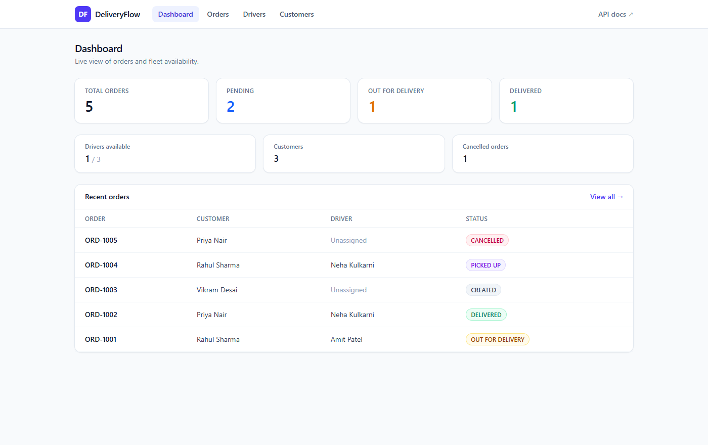
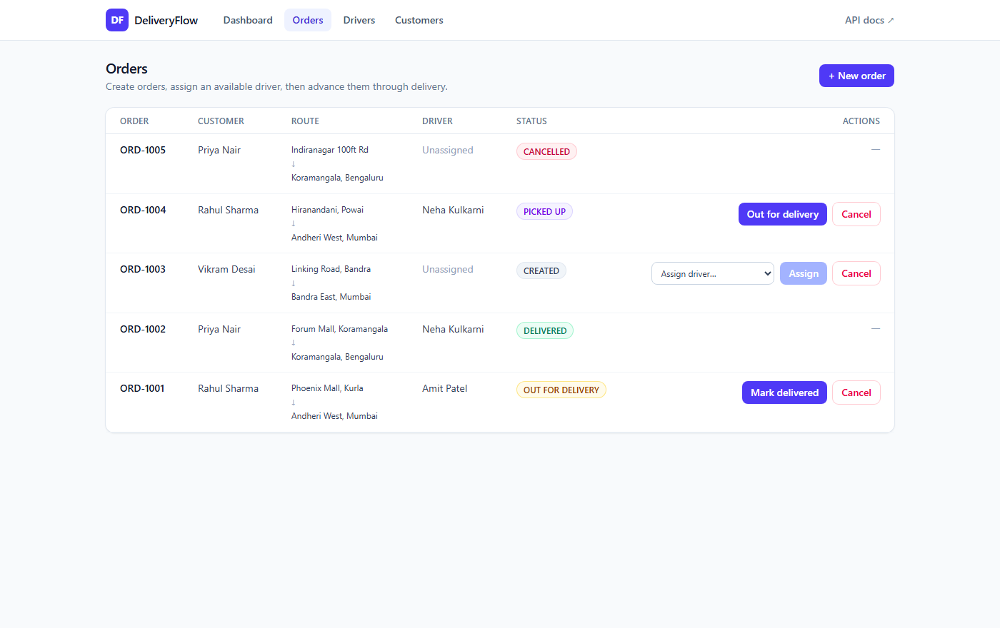
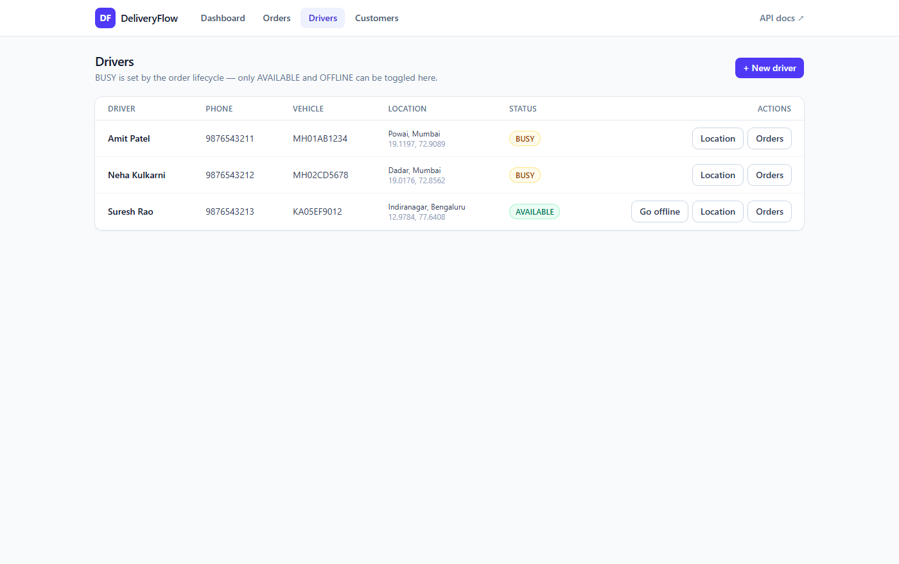
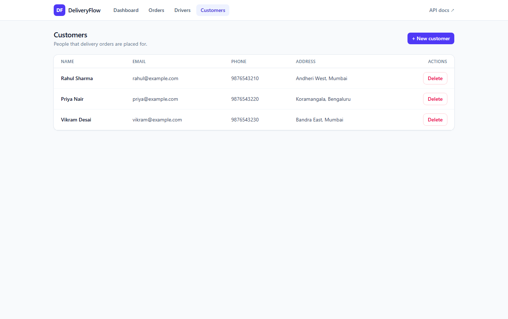

# DeliveryFlow

A delivery management platform for creating delivery orders, assigning drivers, and tracking
each order through its lifecycle — built as a Spring Boot REST API with a React dashboard.

The interesting part is not the CRUD. It is the rules that sit between the controller and the
database: a driver can only be assigned while they are available, assignment books that driver,
completing or cancelling the order releases them, and orders may only move along legal status
transitions.



---

## Stack

| Layer | Technology |
|---|---|
| Language | Java 17 |
| Framework | Spring Boot 4.1 (Spring Framework 7) |
| Persistence | Spring Data JPA, Hibernate |
| Database | MySQL 8 |
| Build | Maven (via the bundled `mvnw` wrapper) |
| Validation | Jakarta Bean Validation |
| Boilerplate | Lombok |
| API docs | springdoc-openapi (Swagger UI) |
| Frontend | React 19, Vite 8, Tailwind CSS 4, React Router 7 |

---

## Architecture

The backend is a conventional layered application. Each layer has one job, and the business
rules live in exactly one of them.

```
        React (Vite dev server :5173)
                    │
                    │  /api proxied to :8080
                    ▼
        ┌───────────────────────┐
        │      Controllers      │  HTTP, status codes, request validation
        └───────────┬───────────┘
                    ▼
        ┌───────────────────────┐
        │       Services        │  business rules, transactions
        └───────────┬───────────┘
                    ▼
        ┌───────────────────────┐
        │   JPA Repositories    │  queries
        └───────────┬───────────┘
                    ▼
              Hibernate / JDBC
                    ▼
                  MySQL
```

A single request, end to end:

```
POST /api/orders → OrderController → OrderService → OrderRepository → Hibernate → MySQL
```

**Why the layers are worth keeping separate.** Controllers never touch business rules, so the
same rule holds no matter which endpoint reaches it. Services never return entities, so lazy
Hibernate proxies cannot leak into JSON. Repositories never contain conditional logic, so they
stay trivially replaceable.

---

## Data model

```
   Customer  1 ────────< *  Order  * >──────── 1  Driver
```

Both relationships are unidirectional `@ManyToOne` on the order side. There is deliberately no
`@OneToMany` back-reference: it would invite recursive JSON serialisation and unbounded
collection loads. Fetching a driver's orders is a repository query instead.

**customers**

| Column | Type | Notes |
|---|---|---|
| id | BIGINT | PK, auto increment |
| name | VARCHAR(100) | required |
| email | VARCHAR(150) | required, unique |
| phone | VARCHAR(20) | required |
| address | VARCHAR(255) | required |
| created_at | DATETIME | set on insert |

**drivers**

| Column | Type | Notes |
|---|---|---|
| id | BIGINT | PK, auto increment |
| name | VARCHAR(100) | required |
| phone | VARCHAR(20) | required, unique |
| vehicle_number | VARCHAR(20) | required, unique |
| status | ENUM | `AVAILABLE` · `BUSY` · `OFFLINE` |
| current_location | VARCHAR(255) | optional |
| latitude / longitude | DOUBLE | optional |
| created_at | DATETIME | set on insert |

**orders** (the entity is `DeliveryOrder`, because `ORDER` is a reserved SQL keyword)

| Column | Type | Notes |
|---|---|---|
| id | BIGINT | PK, auto increment |
| order_number | VARCHAR(20) | unique, rendered as `ORD-1001` |
| customer_id | BIGINT | FK → customers, required |
| driver_id | BIGINT | FK → drivers, null until assigned |
| pickup_address | VARCHAR(255) | required |
| delivery_address | VARCHAR(255) | required |
| status | ENUM | see below |
| created_at / updated_at | DATETIME | maintained by JPA lifecycle callbacks |

Enums are persisted with `EnumType.STRING`, so the database holds `OUT_FOR_DELIVERY` rather
than an ordinal that would silently change meaning if the enum were reordered.

---

## Business rules

**Order state machine.** The legal transitions live on the `OrderStatus` enum itself, so there
is one source of truth rather than a copy in the service and another in the UI.

```
CREATED ──> ASSIGNED ──> PICKED_UP ──> OUT_FOR_DELIVERY ──> DELIVERED
   │            │             │                │
   └────────────┴─────────────┴────────────────┴──> CANCELLED
```

`DELIVERED` and `CANCELLED` are terminal. Anything else is rejected with `409` and a message
naming what *is* allowed:

```
Invalid status transition: DELIVERED -> CREATED. Allowed from DELIVERED: none (terminal state)
```

**Driver availability.** Three rules keep driver state consistent with order state:

1. A driver can only be assigned while their status is `AVAILABLE`.
2. Assignment sets the order to `ASSIGNED` and the driver to `BUSY`, in one transaction.
3. Reaching a terminal state releases the driver back to `AVAILABLE`.

Rule 3 covers cancellation as well as delivery. If cancelling did not release the driver, any
cancelled order would strand its driver in `BUSY` forever and slowly drain the fleet.

`BUSY` cannot be set by hand through `PUT /api/drivers/{id}/status` — it is owned by the order
lifecycle. Allowing manual edits would let a driver be marked available mid-delivery, and the
assignment guard would then hand them a second order.

**Deleting is not always allowed.** `DELETE /api/orders/{id}` cancels the order rather than
removing the row: an order a driver is part-way through is history worth keeping, and the
driver still needs releasing. `DELETE /api/customers/{id}` is refused with `409` if that
customer has orders, instead of surfacing a raw foreign-key error.

---

## API

17 endpoints. Full interactive documentation runs at
**http://localhost:8080/swagger-ui.html** once the app is started.

### Customers

| Method | Path | Purpose |
|---|---|---|
| POST | `/api/customers` | Create a customer |
| GET | `/api/customers` | List all |
| GET | `/api/customers/{id}` | Get one |
| DELETE | `/api/customers/{id}` | Delete (refused if they have orders) |

### Drivers

| Method | Path | Purpose |
|---|---|---|
| POST | `/api/drivers` | Create a driver (starts `AVAILABLE`) |
| GET | `/api/drivers` | List all |
| GET | `/api/drivers/available` | List only assignable drivers |
| GET | `/api/drivers/{id}` | Get one |
| PUT | `/api/drivers/{id}/status` | Toggle `AVAILABLE` / `OFFLINE` |
| PUT | `/api/drivers/{id}/location` | Update coordinates |
| GET | `/api/drivers/{id}/orders` | Orders assigned to this driver |

### Orders

| Method | Path | Purpose |
|---|---|---|
| POST | `/api/orders` | Create an order (starts `CREATED`) |
| GET | `/api/orders` | List all, newest first |
| GET | `/api/orders/stats` | Aggregate counts for the dashboard |
| GET | `/api/orders/{id}` | Get one |
| PUT | `/api/orders/{id}/assign/{driverId}` | Assign an available driver |
| PUT | `/api/orders/{id}/status` | Advance through the lifecycle |
| DELETE | `/api/orders/{id}` | Cancel and release the driver |

Worked request/response examples for every endpoint, including the failure cases, are in
[docs/api-examples.md](docs/api-examples.md).

### Error responses

Every failure returns the same shape, with status codes that mean distinct things — `400` the
request was malformed, `404` the entity does not exist, `409` the request was understood but
the domain refused it.

```json
{
  "status": 409,
  "error": "Conflict",
  "message": "Cannot assign driver Amit Patel: driver is currently BUSY",
  "path": "/api/orders/3/assign/1",
  "timestamp": "2026-08-16T15:07:06.09"
}
```

Validation failures add a `fieldErrors` map, which the frontend renders under the offending
inputs:

```json
{
  "status": 400,
  "error": "Bad Request",
  "message": "Validation failed",
  "path": "/api/customers",
  "timestamp": "2026-08-16T15:07:06.02",
  "fieldErrors": {
    "email": "Email must be a valid address",
    "phone": "Phone must be exactly 10 digits"
  }
}
```

---

## Running it

### Prerequisites

- **Java 17+** — `java -version`
- **Node 18+** — `node -v`
- **MySQL 8** running on `localhost:3306`

Maven is not required; the repository ships the `mvnw` wrapper.

### 1. Create the database and application user

Run once, as MySQL root. The application deliberately connects as a dedicated user scoped to
this one schema, so no root credentials ever appear in a config file.

```sql
CREATE DATABASE deliveryflow CHARACTER SET utf8mb4 COLLATE utf8mb4_unicode_ci;
CREATE USER 'deliveryflow'@'localhost' IDENTIFIED BY 'deliveryflow123';
GRANT ALL PRIVILEGES ON deliveryflow.* TO 'deliveryflow'@'localhost';
FLUSH PRIVILEGES;
```

On Windows, if `mysql` is not on your PATH:

```
"C:\Program Files\MySQL\MySQL Server 8.0\bin\mysql.exe" -u root -p
```

Hibernate creates the tables on first start (`ddl-auto=update`), and `data.sql` seeds three
customers and three drivers.

### 2. Start the backend

```bash
./mvnw spring-boot:run          # macOS / Linux
.\mvnw.cmd spring-boot:run      # Windows PowerShell — the .\ prefix is required
```

Wait for `Started DeliveryflowApplication`. The API is on **http://localhost:8080**.

### 3. Start the frontend

In a second terminal:

```bash
cd frontend
npm install     # first run only
npm run dev
```

Open **http://localhost:5173**.

Vite proxies `/api` to `:8080`, so the browser sees a single origin and CORS never applies
during development. A `CorsConfig` pinned to `localhost:5173` exists as a fallback for calling
the API directly from a browser tab.

### Configuration

Credentials are overridable by environment variable, defaulting to the dedicated user:

```properties
spring.datasource.username=${DB_USERNAME:deliveryflow}
spring.datasource.password=${DB_PASSWORD:deliveryflow123}
```

---

## Project structure

```
src/main/java/com/deliveryflow/
├── controller/     CustomerController · DriverController · OrderController
├── service/        CustomerService · DriverService · OrderService
├── repository/     CustomerRepository · DriverRepository · OrderRepository
├── entity/         Customer · Driver · DeliveryOrder · DriverStatus · OrderStatus
├── dto/            request records (validated) + response records
├── exception/      ResourceNotFoundException · BusinessRuleException
│                   DuplicateResourceException · ErrorResponse
│                   GlobalExceptionHandler
├── config/         WebConfig (CORS) · OpenApiConfig
└── DeliveryflowApplication.java

src/main/resources/
├── application.properties
└── data.sql        seed customers and drivers

frontend/src/
├── api/client.js   fetch wrapper, unwraps the API error shape
├── components/     StatusBadge · Modal · Field · Ui (Button, Card, Table, Banner)
├── pages/          Dashboard · Orders · Drivers · Customers
└── App.jsx         layout and routes
```

---

## Notable implementation details

**Requests and responses are separate types.** Controllers never accept or return entities.
Request records carry the validation annotations; response records flatten the object graph, so
an order row arrives as `customerName` and `driverName` rather than nested objects. This is
what keeps Hibernate proxies out of the serialiser.

**`open-in-view` is disabled.** Lazy associations must therefore be initialised inside the
transaction that loads them, which the repository does with explicit `LEFT JOIN FETCH` queries.
That also removes the N+1 select problem when listing orders.

**The UI does not duplicate the state machine.** Each order response includes
`allowedTransitions`, computed from the enum. The frontend renders exactly those actions, so it
can only ever offer moves the backend will accept — the rules cannot drift out of sync.

**Seed data is idempotent.** `data.sql` uses `INSERT IGNORE` against unique keys, so restarting
against an already-seeded database is a no-op rather than an error.

---

## Screenshots

**Orders** — every status with context-appropriate actions; unassigned orders show a dropdown
of only the drivers who are actually free.



**Drivers** — `BUSY` rows have no manual status toggle, because that state belongs to the order
lifecycle.



**Customers**



---

## Scope

Intentionally left out to keep the project focused: authentication, real-time GPS tracking and
maps, route optimisation, notifications, payments, WebSockets, message queues, caching,
microservices, and CI/CD. The goal was a correct, well-structured delivery domain rather than a
survey of technologies.
